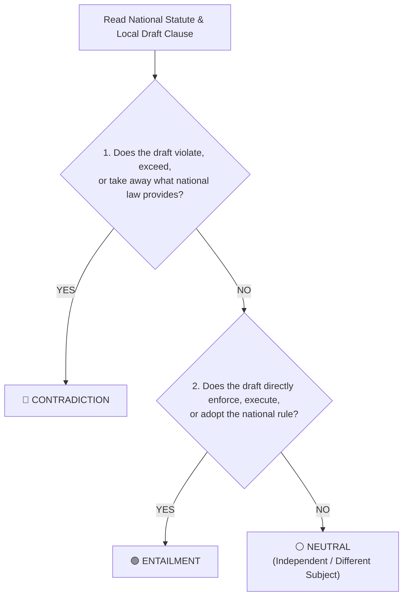

# Sangguniang Panlungsod Legal Annotation Guidebook
## *Evaluating National Statute vs. Local Ordinance Legal Consistency*
**Ateneo de Davao University — Department of Computer Science**  
*In Collaboration with the Sangguniang Panlungsod of Davao City*

---

## 1. Project Purpose & Your Role

Welcome! As a legal researcher or legislative staff member of the Sangguniang Panlungsod, your everyday work ensures that Davao City ordinances are well-crafted, effective, and legally sound.

Our research team is building an automated tool to assist local governments in screening draft ordinance provisions **before** they are enacted, flagging potential legal clashes against national laws early in the committee review process.

To test and ensure the accuracy of this tool, we need **Domain Expert Ground Truth**—reliable, real-world evaluations from legal professionals like you.

---

## 2. The Core Task: Comparing Text Pairs

For each review item, you will compare two legal texts:

1. **National Statute (The Benchmark):** A specific section from a Philippine Republic Act or national law.
2. **Proposed Local Ordinance (The Draft Clause):** A drafted section of a proposed Davao City ordinance.

Your goal is to answer one straightforward question:
> **"Based strictly on this national statute provision, does the local ordinance draft conflict with it, comply with it, or regulate a completely separate matter?"**

```
┌─────────────────────────┐
│   National Statute      │
│     (The Rule)          │
└────────────┬────────────┘
             │
             ▼   COMPARE
┌─────────────────────────┐
│ Proposed Local Clause   │
│     (The Draft)         │
└────────────┬────────────┘
             │
             ├───> 🔴 CONTRADICTION (Conflicts with or exceeds national law)
             ├───> 🟢 ENTAILMENT    (Directly complies with or executes national law)
             └───> ⚪ NEUTRAL       (Independent / Regulates a different subject)
```

> [!IMPORTANT]
> **Evaluate Single Pairs Only:**
> Please judge each pair **only** against the specific National Statute section provided in that item. Do not bring in other unlisted statutes from memory when deciding on that specific pair.

---

## 3. The Three Choices Explained in Plain English

---

### 🔴 Choice 1: CONTRADICTION (Legal Conflict / Overreach)

**Meaning:** The draft local ordinance **violates, weakens, or exceeds** what the national statute establishes (*Ultra Vires* / Magtajas Doctrine).

#### Common Examples:
* **Exceeding Penalty Limits:** National law (*RA 7160 Sec. 458*) caps city fines at **₱5,000** and imprisonment at **1 year**. A local draft imposing **₱25,000** or property forfeiture is a **Contradiction**.
* **Exceeding Time Ceilings:** National law (*RA 7581*) limits automatic calamity price freezes to **60 days**. A local draft mandating a **180-day** freeze is a **Contradiction**.
* **Taking Away Guaranteed Rights/Discounts:** National law (*RA 11314*) guarantees a **20% student fare discount all year**. A local draft reducing it to **10%** or suspending it during school breaks is a **Contradiction**.
* **Overstepping Authority:** National law places electric utility rates under the Energy Regulatory Commission (ERC) and telecom franchises under Congress/NTC. A local draft attempting to set electric retail rate caps or issue telecom franchises is a **Contradiction**.
* **Violating Protected Procedures:** National law (*RA 9344*) exempts youth aged 15 and below from criminal prosecution. A local draft arresting 12-year-olds or holding minors overnight in police cells is a **Contradiction** (even if the draft politely calls it "overnight reflection in a sanctuary").

---

### 🟢 Choice 2: ENTAILMENT (Compliant / Lawful Execution)

**Meaning:** The draft local ordinance **directly adopts, enforces, or lawfully executes** what the national law requires or authorizes, staying within legal boundaries.

#### Common Examples:
* **Direct Adoption:** The local draft adopts national highway speed limits (e.g., **80 km/h** for cars under *RA 4136*).
* **Lawful Budget Allocation:** The local draft allocates exactly **20%** of its revenue allotment to development projects (*RA 7160 Sec. 287*) or **5%** to calamity funds (*RA 10121*).
* **Respecting Statutory Steps:** The local draft requires quarry operators to obtain a national DENR Environmental Compliance Certificate before receiving a Mayor's Permit.
* **Non-Custodial Youth Care:** The local draft directs apprehended minors to community-based guidance and counseling rather than jail, adhering to *RA 9344*.

---

### ⚪ Choice 3: NEUTRAL (Independent / Unrelated Subjects)

**Meaning:** Both laws may share a broad general category (such as public health, transport, or taxation), but they **govern completely separate obligations** and do not conflict or depend on each other.

#### Common Examples:
* **Public Health:** The national law requires **reporting communicable diseases to the DOH**, while the local draft sets **sanitation rules for cleaning clinic waiting room benches** or **banning mercury thermometers**.
* **Local Government:** The national law sets **juvenile criminal exemption age (15 years old)**, while the local draft sets **minimum floor dimensions for daycare centers (30 sq.m.)**.
* **Public Utilities:** The national law sets **national speed limits**, while the local draft specifies **reflective tape widths on street sweeper vests** or **median shrub pruning heights**.

---

## 4. Quick Decision Flowchart

When reviewing any item, follow this 3-step check:



---

## 5. Cheat Sheet: Key National Legal Limits

| Legal Field | National Law Rule | Red Flag in Local Draft (Contradiction) |
| :--- | :--- | :--- |
| **City Ordinance Penalties** | Max **₱5,000 fine** / **1 year jail** *(RA 7160 Sec. 458)* | Drafts setting ₱10k–₱25k fines or confiscating land titles. |
| **Calamity Price Control** | Max **60 days** duration *(RA 7581 Sec. 6)* | Drafts imposing 90-day or 180-day freezes. |
| **Government Processing (EODB)**| Max **3 days** (Simple), **7 days** (Complex) *(RA 11032)* | Drafts allowing 15 days for simple permits or indefinite delays. |
| **Student Fare Discount** | **20% discount**, year-round on all public transit *(RA 11314)* | Drafts lowering discount to 10% or suspending during vacations. |
| **Juvenile Justice** | Age **15 and below** exempt from criminal liability *(RA 9344)* | Drafts locking up minors or charging 12-year-olds in court. |
| **Real Property Tax** | Max **2%** basic tax rate for cities *(RA 7160 Sec. 233)* | Drafts setting 3% to 5%, or letting assessors hike rates without council ordinance. |
| **Amusement Tax** | Max **30%** gross receipts; school events exempt *(RA 7160 Sec. 140)* | Drafts charging 35%, or levying tax on school plays/games. |
| **Local Development Fund** | At least **20%** of Annual Tax Allotment *(RA 7160 Sec. 287)* | Drafts setting less than 20% (e.g., 7%) or using funds for office travel. |
| **Disaster Fund (LDRRMF)** | At least **5%** of regular revenue; 30% Quick Response *(RA 10121)* | Drafts setting 2%, using QRF for tourism, or reverting unspent funds to General Fund. |

---

## 6. Step-by-Step Google Forms Workflow

You will receive an official link to the **SP Legal Annotation Master Google Form** via email or engagement packet.

* **Open the Official Link:** Access the evaluation Google Form link provided in your panel email or engagement packet.
* **Section 1 — Evaluator Verification:** Select your assigned Evaluator ID (e.g., `SP-ANN-01`) and designated Panel/Set from the dropdown. The form will automatically branch into your specific 70-pair block.
* **Section 2 — Pair Evaluation:** For each item (1 to 70), read the National Statute Premise and Municipal Ordinance Hypothesis, select your classification (**Contradiction**, **Entailment**, or **Neutral**), select your confidence score (**1 to 3**), and optionally add a brief legal basis note.
* **Estimated Time & Pacing:** Evaluating 70 items takes approximately 60 to 90 minutes (~1 minute per pair). If logged into your Google account, Google Forms automatically saves draft responses, allowing you to complete the evaluation in 1 or 2 sittings.
* **Final Submission:** Click **SUBMIT** at the end of the form. A confirmation screen will display: *“Thank you! Your legal evaluation has been recorded.”*

---

## 7. Panel Consensus & Adjudication Rules

* **Batch Size:** Each annotator evaluates **70 pairs** (estimated time: 60 to 90 minutes total).
* **Independent Review:** Please evaluate each item independently without conferring with other panel members beforehand to preserve data validity.
* **Majority Agreement (2/3 Rule):** If at least 2 out of 3 reviewers in your panel select the same label, that label becomes the final Ground Truth.
* **Tie-Breaker:** In rare cases of a 3-way split (1 Contradiction, 1 Entailment, 1 Neutral), the **Lead Adjudicator (Senior Legal Researcher)** will review the pair and make the final determination.

---

*Thank you for lending your legal expertise to the development of AI-assisted legislative review tools for Davao City!*
